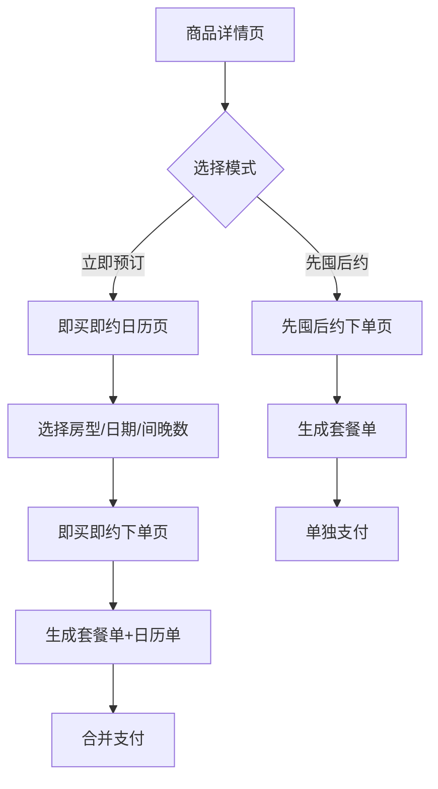

# 预约方式

## 定义
预约方式是用户使用套餐产品的方式，区别于类目分类。**电子凭证** 和 **日历套餐** 是两种主要的预约方式，它们描述的是"用户如何使用产品"，而非"产品是什么"。

## 核心概念澄清

| 维度 | 说明 | 示例 |
|------|------|------|
| 类目 | 产品的业务分类 | 境内酒店套餐 |
| 预约方式 | 用户使用产品的方式 | 电子凭证、日历套餐 |

**重要**：大家常说的"电子凭证套餐"、"日历套餐"指的是类目下的预约方式，不指某个具体的类目。

---

## 电子凭证套餐的两种购买模式

电子凭证套餐支持两种购买模式：**先囤后约** 和 **即买即约**。这两种模式可以出现在同一个商品里。

### 先囤后约（传统模式）

用户购买套餐凭证后，后续再预约入住日期。

| 维度 | 说明 |
|------|------|
| 购买路径 | 购买套餐凭证 → 后续预约日期 |
| 订单生成 | 生成1笔套餐订单 |
| 支付方式 | 单独支付套餐金额 |
| 库存锁定 | 购买后锁凭证，预约时锁库存 |
| 适用人群 | 长期规划型用户 |
| 权益享受 | 全链路权益表达 |

### 即买即约（新模式）

用户在生成第一单套餐单时**直接创建一笔预约日历单**，在购买时就确定入住日期。

| 维度 | 说明 |
|------|------|
| 购买路径 | 购买时直接选择入住日期 |
| 订单生成 | 同时生成2笔订单（套餐单+日历单） |
| 支付方式 | 合并支付（套餐金额+补差金额） |
| 库存锁定 | 购买时直接锁定库存 |
| 适用人群 | 即时决策型用户 |
| 权益享受 | 仅即买即约链路享受专属权益 |

### 用户分群背景

套餐用户从"价格敏感型"分化出两类：
- **即时决策型**（50%用户）：购买后0～3天内预约
- **长期规划型**：购买后3天以上预约

---

## 即买即约准入规则

商品开启即买即约需满足：

1. **白名单**：在 sellerid + itemid 的白名单中
2. **配置至少1个专属权益**：
   - 免费改期
   - 免费升房
   - 立减活动（平台工具8 / 商家工具3）
   - 高价值促核权益（延退、行政礼遇、下午茶等）
3. **不支持即买即约的商品类型**：
   - 国际不落库商品
   - 配置出行人组件商品
   - 酒+酒商品
   - ebk快速发品

### 即买即约不支持的业务场景

- 预售
- 购物车合并下单
- 预约时和同SKU其他预约晚数合并预约

> 注：不是item粒度不支持，若该item用先囤后约方式下单，仍支持上述场景

---

## 即买即约专属权益

| 权益类型 | 配置规则 | 使用范围 |
|----------|----------|----------|
| 免费改期 | 可限制入住日期范围 | 仅即买即约链路享受 |
| 免费升房 | 关联rate时限制入住日期 | 仅即买即约链路享受 |
| 立减优惠 | 支持配置入住日期范围+下单时间范围 | 仅即买即约链路享受 |
| 高价值权益 | 需标注享受权益的日期范围 | 仅即买即约链路享受 |

**权益优先级**：立减 > 改期 > 升房

---

## 订单与资金流

### 即买即约订单结构
- **订单数量**：2笔（套餐订单 + 日历订单）
- **资金流拆分**：
  - 套餐订单对应套餐金额（优惠金额用在套餐单）
  - 日历订单对应补差金额

### 特殊场景处理
- 套餐订单或日历订单任一创单失败/可见失败 → 下单失败，两单同步取消
- 待支付状态 → 合并支付或合并取消

---

## 用户流程对比

---

## 类目与预约方式的对应关系

| 类目 | 支持的预约方式 |
|------|---------------|
| 境内酒店套餐 | 电子凭证（先囤后约/即买即约）、日历套餐 |
| 境外酒店套餐 | 待补充 |
| 在线预约套餐 | 电子凭证（先囤后约/即买即约） |
| 境外在线申请套餐 | 待补充 |
| 酒店餐饮美食 | 待补充 |
| 酒店服务（新） | 待补充 |

---

## 业务影响
预约方式的不同会影响：
1. **下单流程**：日历套餐需要选择日期，电子凭证不需要
2. **库存逻辑**：日历套餐需要实时库存，电子凭证是虚拟库存
3. **退款规则**：预约方式不同，退款策略可能不同
4. **用户体验**：两种方式的用户决策路径不同

## 相关概念
- [[类目分类体系]]

## 相关页面
- [[套餐详情页]] - 即买即约入口
- [[即买即约日历页]] - 选择房型/日期/间晚数
- [[即买即约下单页]] - 立即预订下单
- [[先囤后约下单页]] - 先囤后约下单

## 参考资料
- [[source-category-ids]]
- [[source-即买即约PRD]]
