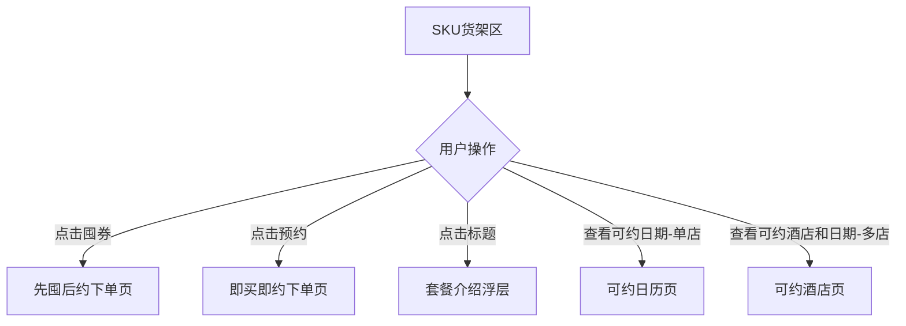

# 套餐选择区（SKU货架区）

## 概述
展示可选的套餐SKU列表，是用户选择具体套餐规格的核心决策模块。每个SKU卡片包含标题区、标签区、维度信息（加价+库存可住）、住吃享文案等结构化信息。

## 核心属性

| 属性 | 值 |
|------|-----|
| 模块序号 | 10 |
| 模块类型 | SKU选择模块 |
| 文档状态 | ✅ 已补充 |

---

## SKU卡片结构

每个SKU在货架上的卡片由以下区域组成：

### 1. 标题区
- **内容来源**: 取SKU的标题
- **交互**: 点击后拉起**套餐介绍浮层**

### 2. 标签区
- **内容来源**: 取SKU优势标签
- **展示规则**: 按优先级取**前3个**标签

### 3. SKU维度信息

SKU维度包含**加价维度**和**库存可住维度**两类：

| 维度类型 | 展示内容 | 说明 |
|----------|---------|------|
| 加价维度 | 加价金额 | SKU相对基础价的加价 |
| 库存可住维度 | 住x晚，提前x天预约 | 可住规则 |

#### 查看可约日期
- **单店**: 点击"查看可约日期" → 跳转**可约日历页**
- **多店（通兑）**: 点击"查看可约酒店和日期" → 跳转**可约酒店页**（二级页面）

### 4. 住吃享文案

#### 住（房型信息）

| 场景 | 主内容 | 辅助内容 |
|------|--------|---------|
| 单店（含多房型） | 可选x类房型 | {房型名称1}或{房型名称2} |
| 通兑（多店多房型） | 多房型可住 | 以实际预约为准 |

#### 吃（餐饮信息）

| 场景 | 主内容 | 辅助内容 |
|------|--------|---------|
| 多种餐饮 | 包含{x}类餐饮 | {餐饮名称1}、{餐饮名称2} |
| 仅含早餐 | 早餐 x份/晚 | — |

#### 享（服务信息）

| 场景 | 主内容 | 辅助内容 |
|------|--------|---------|
| 含服务 | 包含{x}类服务 | {享元素名称1}、{享元素名称2} |

---

## 可约酒店页（二级页面）

通兑商品（item关联>=2个shid）点击"查看可约酒店和日期"后进入此页面。

### 页面功能
| 功能 | 说明 |
|------|------|
| 搜索栏 | 根据酒店名称**模糊匹配** |
| 酒店档位标签 | 酒店档位以标签形式展示 |
| 查看酒店信息 | 点击跳转**小搜detail页**（酒店日历页） |
| 其余样式 | 与线上一致 |

---

## 选择后的跳转逻辑

SKU货架区是先囤后约和即买即约两种模式的分流入口。

### 跳转规则

| 操作 | 跳转目标 | 购买模式 | 订单类型 |
|------|---------|---------|---------|
| **囤券** | [[先囤后约下单页]] | 先囤后约 | 生成1笔套餐订单 |
| **预约** | [[即买即约双Tab下单页]] | 即买即约 | 生成2笔订单（套餐单+日历单） |

> 注：即买即约商品会同时展示"囤券"和"预约"两个入口，用户可自行选择购买模式。非即买即约商品仅展示囤券入口。

---

## Constraints & Edge Cases
- 标签区最多展示**3个**优势标签
- 通兑商品（多店）的房型辅助内容统一为"以实际预约为准"，不展示具体房型名称
- 仅含早餐时，餐饮文案格式特殊化为"早餐 x份/晚"
- 即买即约入口是否展示取决于商品是否在黑名单中（参考 [[预约方式]] 准入规则）
- 可约酒店页的搜索为模糊匹配，非精确匹配

## 所属页面
- [[套餐详情页]]

## 相关模块
- [[套餐权益描述区]] — SKU选择后展示对应权益
- [[日期选择区]] — 与可约日历联动
- [[底部操作栏]] — 囤券/预约操作入口

## 相关概念
- [[预约方式]] — 先囤后约 vs 即买即约，决定SKU操作入口
- [[业务语义字典]] — 单店/通兑决定是否展示可约酒店页

## 参考资料
- Figma: https://www.figma.com/design/Ie64fxMQEYOqMfhyiRhyKU/Untitled?node-id=2-651
