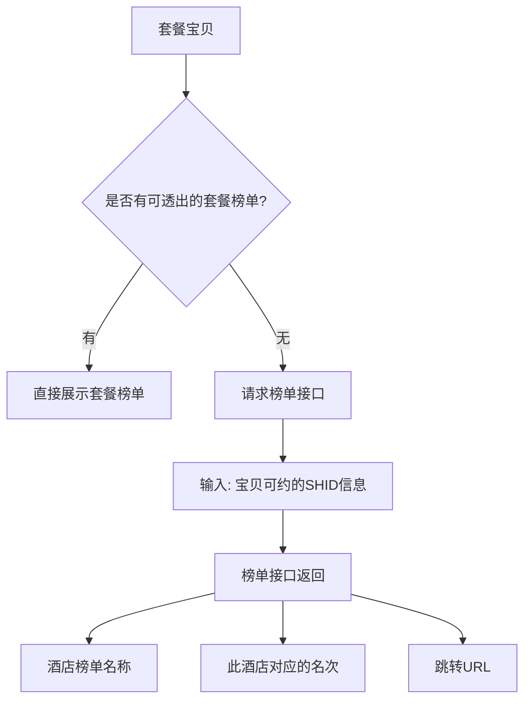

# 榜单标签

## 概述
展示套餐宝贝对应酒店的榜单排名信息，提升用户信任和购买决策。通过请求榜单接口获取酒店榜单数据，支持点击跳转到酒店榜单页。

## 核心属性

| 属性 | 值 |
|------|-----|
| 模块序号 | 6 |
| 模块类型 | 营销标签模块 |
| 文档状态 | ✅ 已补充 |

---

## 榜单获取逻辑

### 请求流程

### 接口交互

| 维度 | 说明 |
|------|------|
| **触发条件** | 套餐宝贝无可透出的套餐榜单时 |
| **请求输入** | 宝贝可约的 SHID 信息 |
| **返回字段 1** | 酒店榜单名称 |
| **返回字段 2** | 此酒店对应的名次 |
| **返回字段 3** | 跳转 URL |

### 交互行为
- **点击榜单** → 跳转到酒店榜单页面（使用接口返回的 URL）

---

## 通兑特殊逻辑

- **通兑宝贝无需获取酒店榜单**
- 原因：通兑商品关联多个酒店（shid>=2），无法确定展示哪个酒店的榜单

详见 [[业务语义字典]] 中"单店 vs 通兑"的定义

---

## Constraints & Edge Cases
- 仅在无套餐榜单时才降级请求酒店榜单
- 通兑宝贝（item关联>=2个shid）不获取也不展示酒店榜单
- 榜单接口返回为空时，该模块不展示

## 所属页面
- [[套餐详情页]]

## 相关概念
- [[业务语义字典]] — 单店/通兑决定是否获取酒店榜单

## 参考资料
- Figma: https://www.figma.com/design/Ie64fxMQEYOqMfhyiRhyKU/Untitled?node-id=2-651
