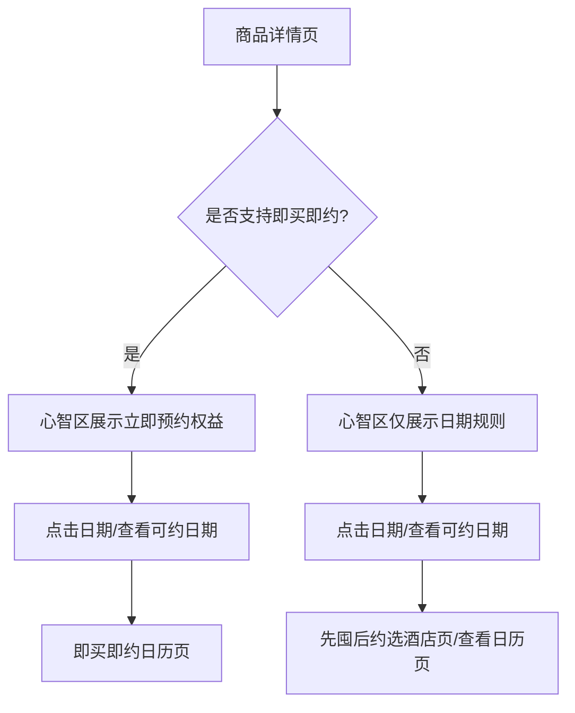

# 套餐详情页

## 概述
套餐详情页是用户决策的核心页面，承载着从浏览到转化的关键任务。页面上接频道页/日历页，下接SKU浮层和下单页，是D2O转化的关键节点。

**重要**：详情页是**即买即约**模式的入口页面。

## 核心属性

| 属性 | 值 |
|------|-----|
| 页面定位 | 核心转化页 |
| 核心目标 | 提升D2O转化率 |
| 上游页面 | 频道页、酒店日历页、搜索结果页 |
| 下游页面 | SKU浮层、下单页 |

---

## 即买即约入口判断

### 支持即买即约的商品
满足以下条件的商品在详情页展示即买即约入口：

1. **白名单**：在 sellerid + itemid 的白名单中
2. **配置至少1个专属权益**：免费改期、免费升房、立减活动、高价值促核权益
3. **非排除类型**：非国际不落库商品、非配置出行人组件商品、非酒+酒商品、非ebk快速发品

### 即买即约商品详情页表达

#### 心智区-亮点模块
展示即买即约专属权益表达：

| 权益类型 | 文案规则 |
|----------|----------|
| **免费改期/升房** | "立即预约享免费改期/免费升房" |
| **立减活动** | 金额确定："享最高立减¥x"；金额不确定："下单享优惠" |

**立减优惠兜底规则**：
1. 需要解析即买即约的优惠使用的工具类型（目前仅3和8）
2. 若券后价使用的优惠工具里有任一工具=3或8，则商品详情页不展示立减x元的标签
3. 若同item下有任一sku没有配置即买即约优惠，则item的亮点标签不透出最高立减x元

#### 心智区-日期模块
- 提前x天可约（若x=0，文案"预约开放当日即可预约当天入住"）
- 入住日期（若存在不可住日期，增加"部分日期除外"）

#### 套餐选择区
- 立即预约标签（文案同心智区亮点）
- 去除住x晚、提前x天预约的规则
- 在x元素-住元素后拼接x晚

### 不支持即买即约的商品
- 心智区仅展示日期规则
- 点击日期/查看可约日期进入先囤后约选酒店页/查看日历页

---

## 页面按钮交互

| 入口 | 点击行为 | 备注 |
|------|----------|------|
| 心智区-日期 | 进入选酒店页/即买即约日历页 | 支持即买即约则进入日历页 |
| 商品详情页-购买 | 保持现状（先囤后约） | - |
| SKU的查看可约日期 | 进入即买即约日历页 | 仅支持即买即约的商品 |

---

## 用户流程分流



---

## 页面模块结构（自上而下）

```
套餐详情页
├── 顶部区域
│   ├── 1. 媒体容器区域（顶部Tab）
│   ├── 2. 价格区域
│   ├── 3. 品牌心智区
│   └── 4. 头部信息区
│
├── 信息展示区
│   ├── 5. 服务标签区
│   ├── 6. 榜单标签
│   ├── 7. 囤好货标签区
│   └── 11. 套餐权益描述（图文详情）区
│
├── 决策功能区
│   ├── 8. 日期选择区
│   ├── 9. 日历组件
│   ├── 10. 套餐选择区
│   └── 12. 商品评价区
│
├── 辅助信息区
│   └── 13. 店铺信息区
│
└── 操作区
    └── 14. 底部操作栏
```

---

## 模块列表

| 序号 | 模块名称 | 文档状态 |
|------|---------|---------|
| 1 | [[媒体容器区域]] | ✅ 已补充 |
| 2 | [[价格区域]] | 待补充 |
| 3 | [[品牌心智区]] | 待补充 |
| 4 | [[头部信息区]] | 待补充 |
| 5 | [[服务标签区]] | ✅ 已补充 |
| 6 | [[榜单标签]] | 待补充 |
| 7 | [[囤好货标签区]] | ✅ 已补充 |
| 8 | [[日期选择区]] | 待补充 |
| 9 | [[日历组件]] | 待补充 |
| 10 | [[套餐选择区]] | 待补充 |
| 11 | [[套餐权益描述区]] | 待补充 |
| 12 | [[商品评价区]] | 待补充 |
| 13 | [[店铺信息区]] | 待补充 |
| 14 | [[底部操作栏]] | 待补充 |

---

## 权益使用规则

若商品支持即买即约，则：
- 免费改期、免费升房的权益**仅即买即约订单可享受**
- 先囤后约订单**不可享**即买即约专属权益

---

## 核心转化路径

```
用户进入详情页
    ↓
浏览媒体区（图片/视频）→ 建立第一印象
    ↓
查看价格区域 → 评估价格吸引力
    ↓
阅读头部信息区 → 了解套餐基本信息
    ↓
查看服务标签/榜单标签 → 建立信任
    ↓
选择日期（日期选择区/日历组件）→ 确定出行计划
    ↓
选择套餐SKU（套餐选择区）→ 确定购买内容
    ↓
点击底部操作栏 → 进入下单页
```

---

## Figma设计稿
https://www.figma.com/design/Ie64fxMQEYOqMfhyiRhyKU/Untitled?node-id=2-651&t=jOkqGeUGZKrU8jBr-4

---

## 待补充信息
- [ ] 各模块的详细功能和交互逻辑
- [ ] 模块间的依赖关系
- [ ] 多端差异（iOS/Android/H5/小程序）
- [ ] 历史版本迭代记录

---

## 相关实体
- [[频道页]] — 上游入口
- [[酒店日历页]] — 上游入口
- [[套餐SKU浮层]] — 下游页面
- [[即买即约日历页]] — 即买即约下游页面
- [[即买即约下单页]] — 即买即约下单页面
- [[先囤后约下单页]] — 先囤后约下单页面

## 参考资料
- [[source-detail-page-modules]]
- [[source-即买即约PRD]]
